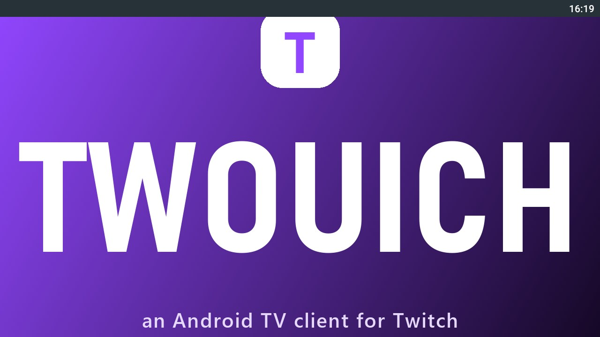
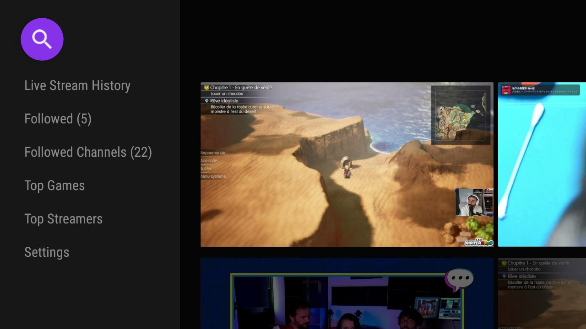

# Twouich

[](https://github.com/Endymi0n74/Twouich/actions/workflows/build.yml)
[](https://github.com/Endymi0n74/Twouich/releases/latest)

Client Android TV pour Twitch, avec filtrage local des marqueurs publicitaires SSAI.

> Projet indépendant, sans affiliation avec Twitch Interactive, Inc.






## Installation

Télécharger [`Twouich_v1.0.7.apk`](https://github.com/Endymi0n74/Twouich/releases/download/v1.0.7/Twouich_v1.0.7.apk) depuis la release publiée.

```bash
adb install -r Twouich_v1.0.7.apk
```


## Projet source et crédits

Twouich est basé sur le projet d'origine [S0undTV](https://github.com/S0und/S0undTV). Merci à ses auteurs et contributeurs pour le travail initial et les bibliothèques utilisées.

Ce dépôt redistribue uniquement des binaires patchés et les patchs associés ; il ne redistribue pas le code source original. Voir [`CREDITS.md`](CREDITS.md) pour les détails.


## Limites

Le filtrage dépend du format actuel des marqueurs publicitaires Twitch. Il ne contourne aucun abonnement ni contenu payant.
