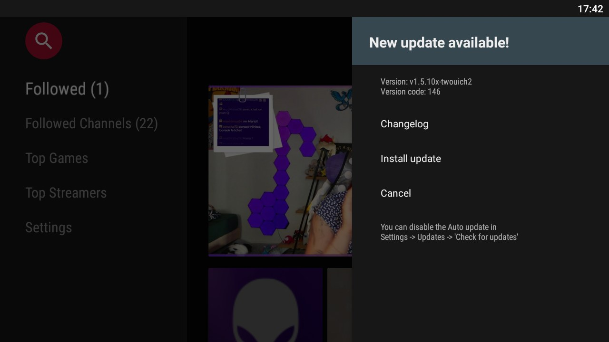
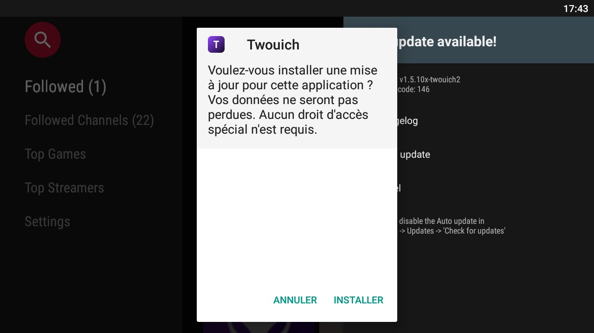

# Twouich — client Twitch pour Android TV, **sans publicité**

Twouich est un **build modifié de S0undTV** (client Twitch alternatif pour Android TV, projet
closed-source de [S0und](https://github.com/S0und/S0undTV)) auquel est greffé un **blocage des
publicités** fonctionnant sur les flux *server-side stitched* (SSAI) de Twitch.

> Projet indépendant, **sans aucune affiliation avec Twitch Interactive, Inc.** ni avec S0und.
> Voir [`CREDITS.md`](CREDITS.md).


## Ce qui est ajouté par rapport à S0undTV

- **Identité Twouich** : nom affiché, écran de démarrage, icônes de lancement, bannière TV, icône
  adaptative, thème par défaut, pages embarquées (À propos / Nouveautés) et images du tutoriel — plus
  rien de la marque d'origine à l'écran. Tout est **calculé** par `patch/branding/make_brand.py` :
  changer d'identité se fait en une commande (`emit --variant A|B|C`), jamais à la main dans les
  ressources. Les six captures du tutoriel sont remappées (rouge d'origine → violet Twouich) plutôt
  que recapturées : la mise en page n'a pas changé et elles sont en 1920×1080 natif.
- **Anti-pub réel** : les plages publicitaires sont retirées de la playlist HLS avant que le
  lecteur ne les voie (`#EXT-X-DATERANGE` / `stitched-ad`, titres `Amazon`, `CUE-OUT`/`CUE-IN`),
  avec conservation des `#EXT-X-DISCONTINUITY` pour que la timeline reste cohérente.
- **Option proxy** : la requête de playlist maître peut partir d'abord par un proxy de ton choix
  (« proxy d'abord »), avec **repli automatique** sur la requête directe si le proxy ne répond pas.
- **Mises à jour autonomes** : l'updater intégré pointe désormais sur **ce dépôt** (il ne tentera
  plus jamais d'installer un build de S0und par-dessus le nôtre).

Écran de démarrage, capturé sur l'appareil ([`images/splash-twouich.jpg`](images/splash-twouich.jpg)) :


Mise à jour autonome, capturée sur l'appareil pendant le test de bout en bout : l'app ouvre **seule**
son écran de mise à jour, puis passe l'APK téléchargé à l'installeur du système
([`TEST-DEVICE.md` § 0.2](TEST-DEVICE.md)).




L'UI Android TV, le chat, les emotes BTTV/FFZ/7TV, le PiP, la VOD avec chat et les notifications
viennent de S0undTV et ne sont pas modifiés : ce build change le comportement (anti-pub, mises à
jour, identité), pas les écrans.

## Installation

⚠️ **La signature est différente de celle de S0undTV** : l'app officielle doit être désinstallée
avant d'installer Twouich (sinon Android refuse la mise à jour). Tes préférences et ta session
seront donc à refaire une fois.

```bash
# 1. Récupérer l'APK (release v1.5.10x-twouich2)
#    https://github.com/Endymi0n74/Twouich/releases
# 2. Depuis un PC, avec adb connecté à la box :
adb uninstall com.s0und.s0undtv || true
adb install -r Twouich_beta144_ttv1.apk
```

Ou plus simple : télécharger l'APK directement sur la TV (Downloader) puis l'installer.

**Mises à jour suivantes** : l'app se met à jour elle-même depuis `update.json` de ce dépôt
(écran « Mise à jour »). Chaque nouvelle version publiée ici est signée avec la **même clé**, donc
les mises à jour s'installent normalement — à condition de ne pas désinstaller entre-temps.
Le parcours complet (dialogue → téléchargement → installeur système → version installée et son
SHA-256) a été exécuté sur un appareil réel : voir `TEST-DEVICE.md` § 0.2.

⚠️ **Si l'app ne vous propose jamais rien** : vérifiez le **canal de mise à jour**
(Réglages → General settings → *Update channel*). Sur le canal **Beta**, l'updater n'accepte que les
entrées marquées `ReleaseType: 1` — une release stable n'y produit aucun dialogue, sans erreur non
plus. Les installations héritées de S0undTV sont souvent en Beta.

## Vérifier que le blocage fonctionne

L'app **trace elle-même** chaque playlist nettoyée :

```
I/Twouich: playlist nettoyee 8412 -> 7103 octets, segments pub retires : 3
```

Donc un test exhaustif tient en deux commandes (installation + capture filtrée + verdict) :

```bash
bash patch/test-device.sh --list           # qui est branché (et quel adb est utilisé)
bash patch/test-device.sh --fresh          # installe et capture le logcat
bash patch/analyze_device_log.sh work/device-test/logcat-<date>.txt   # verdict
```

Et une preuve **déterministe**, sans attendre une coupure publicitaire : le greffon contient un
self-test qui rejoue des playlists publicitaires Twitch dans le **vrai code compilé** et fait
traverser la vraie source de données du lecteur.

```bash
bash patch/test-selftest.sh            # verdict en quelques secondes (l'APK n'est pas installé)
bash patch/test-selftest.sh --in-app   # ou au démarrage de l'app installée
```

```
I/Twouich: SELFTEST 18/18 verifications, flux filtre : 328 octets
```

Sans appareil sous la main, la logique se vérifie entièrement en local :

```bash
bash patch/tests/test_analyzer.sh          # 8 verdicts, sur des captures synthétiques
python patch/tests/test_sanitizer.py       # 22 assertions : règles de nettoyage (miroir Python du smali)
python patch/tests/test_smali_branches.py  # 9 assertions : branchements réels du smali (pièges Dalvik)
```

Procédure complète, checklist à cocher pendant la coupure publicitaire et grille de lecture des
résultats : **[`TEST-DEVICE.md`](TEST-DEVICE.md)**.

## Activer le mode proxy

Le proxy est **désactivé par défaut** : aucun service public n'expose aujourd'hui l'API de relais
« chemin conservé » utilisée ici, et brancher un hôte mort serait pire que de ne rien faire.
Pour l'activer, une seule ligne :

```smali
# patch/smali/com/twouich/adblock/AdBlockDataSource.smali
.field private static final PROXY_HOST:Ljava/lang/String; = "mon-proxy.exemple.net"
```

puis relancer le build. Tant que le proxy répond, il est utilisé ; dès qu'il échoue, l'app repart
sur l'URL d'origine et le stripping local prend le relais.

## Construire l'APK soi-même

```bash
cd Twouich
curl -sSL -o tools/apktool-3.0.3.jar        https://github.com/iBotPeaches/Apktool/releases/…   # apktool 3.x requis
curl -sSL -o tools/uber-apk-signer.jar      https://github.com/patrickfav/uber-apk-signer/releases/…
bash patch/build.sh
```

La clé de signature vit dans `keys/` (jamais versionnée, à sauvegarder ailleurs). Son **mot de passe
n'est pas dans le dépôt** — celui-ci est public, et une clé dont le mot de passe circule permet à
n'importe qui de signer un APK qu'Android acceptera comme une mise à jour de Twouich.
`patch/build.sh` le lit dans `keys/keystore.properties` (ignoré par git) :

```properties
keyAlias=twouich-dev
storePassword=<le mot de passe de la clé>
```

Sans ce fichier (ni `KEY_PASS` dans l'environnement), le script s'arrête **avant** de construire.

La chaîne est **rejouable et idempotente** :

```
APK upstream vérifié par SHA-256 → apktool d → patch/patch.py → apktool b → zipalign → signature v1+v2+v3 → dist/
````patch.py` **échoue bruyamment** si un motif attendu a changé : c'est ce qui permet de constater immédiatement qu'une nouvelle beta upstream demande d'adapter les patchs.

Les règles de nettoyage des playlists et l'identité visuelle sont couvertes par des tests
exécutables sans appareil :

```bash
python patch/tests/test_sanitizer.py      # 22 assertions (miroir Python du smali)
python patch/tests/test_smali_branches.py # 9 assertions (branchements reels du smali)
python patch/tests/test_brand.py          # 14 assertions (assets de marque, rouge mort, zone sure,
                                          #   captures du tutoriel remappees)
python patch/tests/test_apk.py            # 13 verdicts sur l'APK livre (a lancer apres build.sh),
                                          #   dont l'accord avec update.json
bash   patch/check-release.sh             # update.json -> tag -> assets -> octets servis
```

### Changer l'identité visuelle

```bash
python patch/branding/make_brand.py preview          # les 3 pistes, rendues avec leurs vrais assets
python patch/branding/make_brand.py emit --variant B # B = noir Twitch, C = degrade + monogramme
bash patch/build.sh                                  # les assets de marque sont reposés dans l'APK
```

Tout le visuel de marque vient de ce seul fichier (mot-symbole, tagline, palette, composition) :
aucune image n'est retouchée à la main. `patch/branding/assets/` est versionné, donc le build
produit le même APK même sans les polices Windows.

| Élément | Rôle |
|---|---|
| `patch/patch.py` | greffon anti-pub, identité visuelle, repointage de l'updater, bump de version (tous les patchs, en un endroit) |
| `patch/branding/make_brand.py` | identité visuelle : les 3 pistes, les assets Android (`patch/branding/assets/`), l'aperçu HTML |
| `patch/smali/com/twouich/adblock/` | `AdBlockDataSource` (source de données ExoPlayer) + `PlaylistSanitizer` (nettoyage m3u8) + `SelfTest` (self-test embarqué) |
| `patch/test-selftest.sh` | self-test anti-pub de bout en bout sur l'appareil, verdict en une commande |
| `patch/check-release.sh` | la release publiée est-elle bien celle que l'app ira télécharger (tag, assets, octets servis) |
| `patch/build.sh` | chaîne complète, de l'APK upstream à l'APK signé |
| `keys/twouich.keystore` | **clé de signature — jamais versionnée, à sauvegarder** (sans elle, plus aucune mise à jour possible) |
| `AUDIT.md` | audit complet du dépôt et de l'APK, registre des obsolescences |

## Passer à une nouvelle version upstream

1. Mettre à jour `UPSTREAM_URL` **et** le `SHA-256` attendus dans `patch/build.sh` ;
2. `work/decoded` se désassemble à neuf tout seul dès que la version change ; pour forcer malgré
   tout, le supprimer ;
3. `bash patch/build.sh` — si `patch.py` signale un motif introuvable, adapter le patch concerne ;
4. incrémenter `VERSION_CODE` / `VERSION_NAME` dans `patch/build.sh`, publier la release **avec le
   même tag que `VERSION_NAME`**, puis mettre `update.json` à jour (le nom d'APK doit correspondre
   exactement à l'asset téléversé).

## Licence et attribution

L'app modifiée est distribuée **telle quelle, sans garantie**, pour un **usage personnel** : le
code d'origine est closed-source, ce dépôt ne contient donc que des patchs et des binaires signés
par nous. Détails et crédits : [`CREDITS.md`](CREDITS.md).
