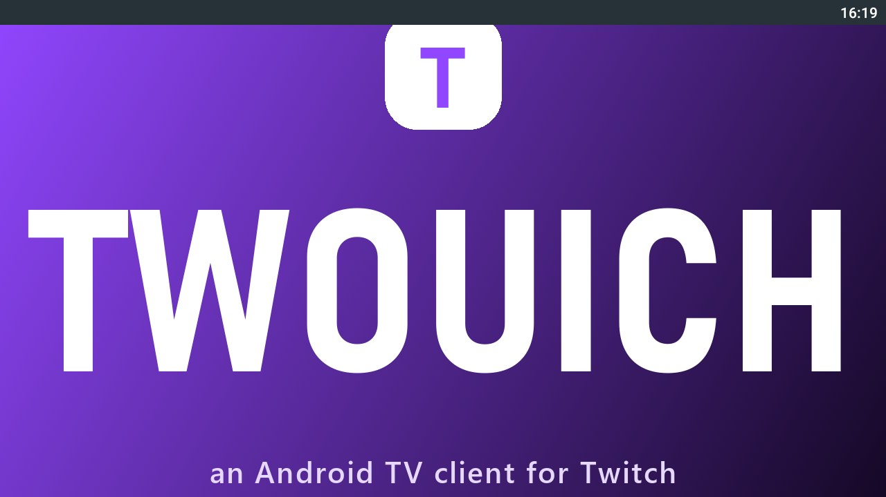
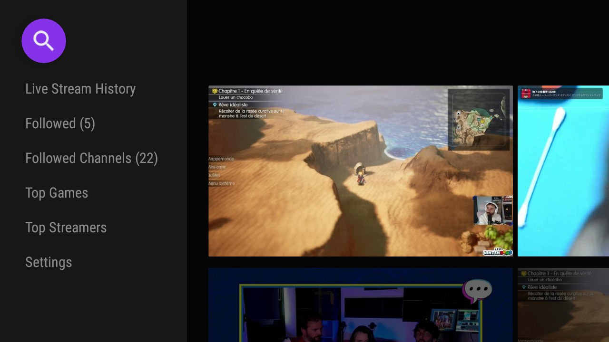

# Twouich

[](https://github.com/Endymi0n74/Twouich/actions/workflows/build.yml)
[](https://github.com/Endymi0n74/Twouich/releases/latest)

**🇫🇷 Français** · [🇬🇧 English](README.en.md)

Client Android TV pour Twitch, avec filtrage local des marqueurs publicitaires SSAI, dé-mute VOD et fallback anti-pub VaFT.

> Projet indépendant, sans affiliation avec Twitch Interactive, Inc.





## Fonctionnalités

- **SSAI local** : retrait `stitched-ad` / `Amazon` / `CUE-OUT` avant lecture ExoPlayer (`PlaylistSanitizer`, `AdBlockDataSource`)
- **VOD dé-mutée** `v1.0.16` : `-unmuted` → `-muted` sur playlists `cloudfront` (son d'origine, issu de `TwVodNoAdsJCed`)
- **Fallback VaFT** `v1.0.16` : si `stitched-ad` survit au stripping (nouveau format), tentative flux propre `GQL PlaybackAccessToken embed` → `usher v2` → variante (5s timeout, repli stripping) (`VaftFallback`, dormant tant que `lastCut>0`)
- **Build reproductible** : ZIP canonisé (horodatage + ordre), `SELFTEST 31/31`, `check-release.sh` 4/4

## Nouveautés v1.0.23 — 6 octobre 2026

- **La rotation pendant la lecture ne disloque plus le lecteur téléphone.** Au passage portrait → paysage, la vidéo garde un 16:9 exact (`1845×1038` dans un écran 2712×1220 simulé) et le chat avec la barre de saisie se rangent en colonne à sa droite — la branche paysage est rejouée avec la géométrie **re-mesurée**, au lieu de la configuration périmée que `onConfigurationChanged` trouvait encore en place.
- **La barre « Envoyer un message » monte au-dessus du clavier.** Mesurée collée au bord haut de l'IME (`y=1687` avec un clavier ouvert jusqu'à 2712), avec le chat qui se raccourcit d'autant ; clavier fermé, l'empilement portrait d'origine est inchangé. La fenêtre étant edge-to-edge (cible 35), `adjustResize` ne suffit pas — et **les insets IME ne rendent rien sur ce MIUI** : la hauteur du clavier est lue par `getWindowVisibleDisplayFrame`, seule source fiable mesurée sur l'appareil. Une veille de disposition (`PhoneLayoutWatch`) rejoue la géométrie à chaque changement de frame visible, avec garde anti-boucle.
- Aucun message n'a été envoyé pendant la validation ; aucune session n'a été perdue (`adb install -r`, `firstInstallTime` préservé). Détail des mesures et recettes : `TEST-DEVICE.md` § 8.26.

## Installation

Télécharger [`Twouich_v1.0.23.apk`](https://github.com/Endymi0n74/Twouich/releases/download/v1.0.23/Twouich_v1.0.23.apk) depuis la release publiée.

```bash
adb install -r Twouich_v1.0.23.apk
```


## Projet source et crédits

Twouich est basé sur le projet d'origine [S0undTV](https://github.com/S0und/S0undTV). Merci à ses auteurs et contributeurs pour le travail initial et les bibliothèques utilisées.

Ce dépôt redistribue uniquement des binaires patchés et les patchs associés ; il ne redistribue pas le code source original. Voir [`CREDITS.md`](CREDITS.md) pour les détails.


## Limites

Le filtrage dépend du format actuel des marqueurs publicitaires Twitch. Les VODs sub-only ne sont lues que si un jeton mémorisé côté app reste accepté par `usher` (comportement serveur, observé sur VOD sub-only). Le fallback VaFT ne s'active que si le stripping échoue et reste replié sur le stripping local en cas d'erreur réseau.
